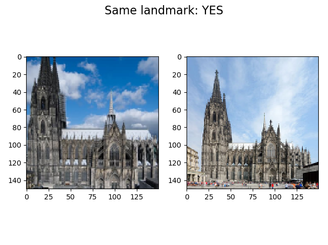
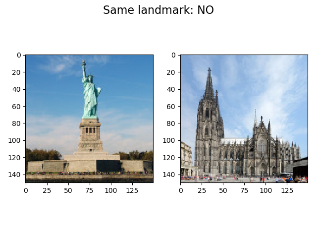

**********************************************************************
		LANDMARK MATCHING 
		
	Author: Emilija Zdilar
	Version: 1.0.0
	Date: 24.2.2019.

	This project is an Image processing course assignment. 
	It is a gradient and color based algorithm for matching
	two images representing a landmark, written in Python. 
	 		
**********************************************************************

Getting Started:

- Download and open project
- Create and activate virtual environment, as per your preference.
- pip install -r requirements.txt
- Navigate to project root folder
- python main.py

**********************************************************************

Example: 
  

**********************************************************************

Prerequisites:
- Python 3.6.5
- numpy 1.15.4
- scikit-image 0.14.0
- scipy 1.2.1
- matplotlib 3.0.3

**********************************************************************

Acknowledgments:
- Computer Vision, Algorithms and Applications,
	by Richard Szeliski
- Computer Vision with OpenCV: HOG Feature Extraction,
	by Ryan Ahmed
	
**********************************************************************
